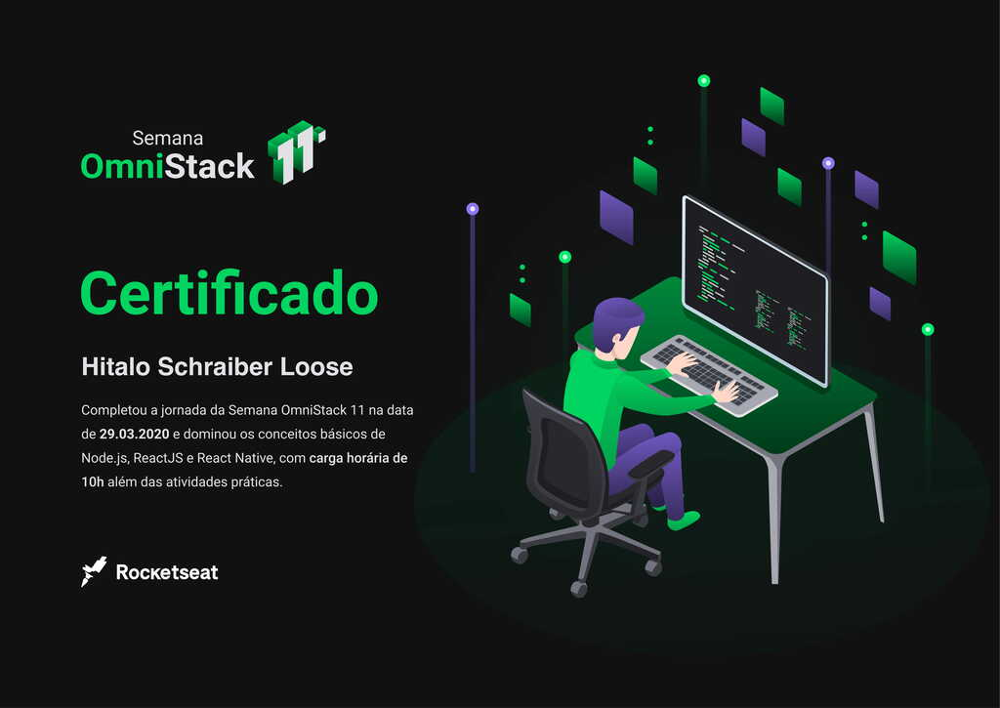

## OmniStack

A OmniStack é um evento realizado de forma periódica, onde a empresa [Rocketseat](https://github.com/rocketseat) propõem o desenvolvimento de um aplicativo, o tutor é [Diego Fernandes](https://github.com/diego3g).
Esse aplicativo é referente a 11° edição do OmniStack realizado entre os dias 23/03/2020 à 29/03/2020, onde o aplicativo proposto foi Be The Hero.

## Be The Hero

Be The Hero é um aplicativo para Ongs encontrarem pessoas que querem os apoiarem, esse aplicativo contém uma página web, voltada para as Ongs se cadastrarem e gerenciar seus casos, e um aplicativo mobile, onde os ajudadores podem ver os casos que as ongs estão precisando de ajuda.

### Web

A página web do Be The Hero serve para as Ongs se cadastrarem, assim um ID único é gerado. Com o ID as ongs podem se logar a página e cadastrar os casos que precisam de ajuda.

### Mobile

O aplicativo mobile é feito para ajudadores ver os casos que todas Ongs cadastraram, e se quiser apoiar algum caso é só acessar os detalhes do caso e entrar em contato com a Ongs por e-mail ou whatsapp.

## Especificações

O aplicativo foi desenvolvido com o conceito MVC, onde temos um Backend, que faz a comunicação com o banco de dados e retorna os dados no formato JSON, e clientes consomem esse Backend, no caso uma página WEB escrita com React, e um aplicativo mobile escrito com React Native

### Backend

O Backend foi feito usando [Nodejs](https://github.com/nodejs/node). Algumas dependências principais usadas foram, [Express](https://github.com/expressjs/express) para controle de rotas e [Knex](https://github.com/knex/knex) como query builder.
Para o teste das rotas foi usado o programa [Insomnia](https://github.com/Kong/insomnia), na pasta do Backend temos uma pasta docs, onde contém as rotas para serem importada para o Insomnia.

O backend pode ser acessado [aqui](https://hitaloose-be-the-hero.herokuapp.com/).

### Frontend

O Frontend foi feito usando [React](https://github.com/facebook/react). As estilizações foram feitas usando CSS puro. Algumas dependencias usandas foram, [React Router Dom](https://github.com/ReactTraining/react-router/tree/master/packages/react-router-dom), para controle de rotas dentro das páginas e [Axios](https://github.com/axios/axios) para fazer requisições ao Backend.

O frontend pode ser acessado [aqui](https://hitaloose-be-the-hero.netlify.com/).

### Mobile

O Aplicativo mobile foi feito usando [React Native](https://github.com/facebook/react-native), foi utilizado [Expo](https://github.com/expo/expo) para ambiente de desenvolvimento. Algumas dependências usadas foram, [React Native Navigation](https://github.com/wix/react-native-navigation), para controle de navegação entre páginas, e [Axios](https://github.com/axios/axios) para fazer requisições ao Backend.

Donwload do apk [aqui](https://exp-shell-app-assets.s3.us-west-1.amazonaws.com/android/%40hitaloose/beTheHero-1628d1ee7d6048e0b874872f16602159-signed.apk)

## Certificado

Nessa edição da semana onmistack foi fornecido um certificado de desempenho.

    

